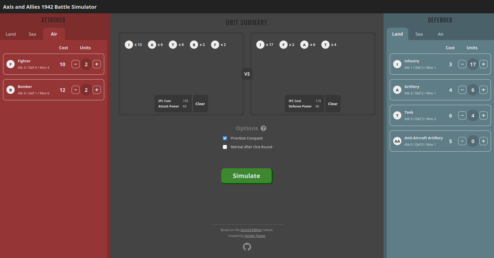

# Axis and Allies 1942 Battle Calculator
Simulates battles for the board game Axis and Allies 1942. Allows you to figure
out the odds that you will win a particular battle, along with a breakdown of
the different likely outcomes.



## Development
This is a React app that manages dependencies using Yarn.

To run locally:
```
$ yarn install
$ yarn serve
```
